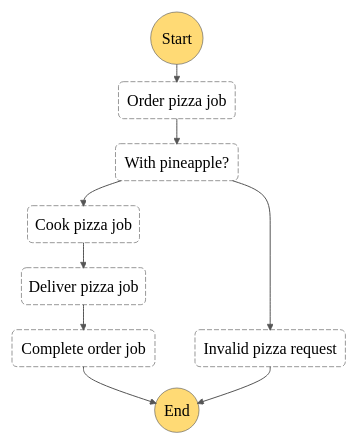

## Pizza Cloud (by Alejandro Mora)

Hi Ben. I hope you are doing great.

I am including in this read me a few notes about the implementation I made in order to complete the requested functionality, so it is easier for you to look at my changes.

First, the following graph shows the flow I defined in the step function:



### Testing It Out

As you know, after deployment you should have an API Gateway HTTP API where on the base url you can send a POST request with a payload in the following format:

```json
// for a succesful execution
{
	"flavour": "pepperoni",
	"deliveryAddress": "110 N Sunset Blvd, Caledonia, MN 55921",
	"customerName": "Alejandro",
	"customerPhoneNumber": "+50683214511"
}

//to see a failure
{
    "flavour": "pineapple",
	"deliveryAddress": "110 N Sunset Blvd, Caledonia, MN 55921",
	"customerName": "Alejandro",
	"customerPhoneNumber": "+50683214511"
}
```

To keep consistency with the original behavior, if you pass in pineapple or hawaiian you should see the step function flow fail in the response payload. I modified the error and cause messages a little bit.

As you noticed, I added more items to the request payload. That is because I added some logic to handle the delivery process, and if you wanted to deliver a pizza in real life you would need a delivery address, plus the name of the customer and probably a phone number to contact them.

The response returned is the raw and full output from the step function so will look something like this:

```json
// A successful execution, note the status of SUCCEEDED
{
    "billingDetails": {
        "billedDurationInMilliseconds": 7100,
        "billedMemoryUsedInMB": 64
    },
    "executionArn": "arn:aws:states:us-west-2:201644695232:express:StateMachine2E01A3A5-17TfZD6kdiB7:b1dc37dd-7954-49bf-b597-02bdb714fd52:03345939-2c9c-4d70-95a1-aacf07ec985d",
    "input": "{\n\t\"flavour\": \"pepperoni\",\n\t\"deliveryAddress\": \"110 N Sunset Blvd, Caledonia, MN 55921\",\n\t\"customerName\": \"Alejandro\",\n\t\"customerPhoneNumber\": \"+50683214511\"\n}",
    "inputDetails": {
        "__type": "com.amazonaws.swf.base.model#CloudWatchEventsExecutionDataDetails",
        "included": true
    },
    "name": "b1dc37dd-7954-49bf-b597-02bdb714fd52",
    "output": "{\"orderNumber\":\"1675150795745\",\"customerName\":\"Alejandro\",\"deliveryAddress\":\"110 N Sunset Blvd, Caledonia, MN 55921\",\"customerPhoneNumber\":\"+50683214511\"}",
    "outputDetails": {
        "__type": "com.amazonaws.swf.base.model#CloudWatchEventsExecutionDataDetails",
        "included": true
    },
    "startDate": 1675150795.132,
    "stateMachineArn": "arn:aws:states:us-west-2:201644695232:stateMachine:StateMachine2E01A3A5-17TfZD6kdiB7",
    "status": "SUCCEEDED",
    "stopDate": 1675150802.134,
    "traceHeader": "Root=1-63d8c5cb-982d1be0a64e8f5d998d5c7e;Sampled=1"
}

// a failed execution, notice status: FAILED and the cause/error properties
{
    "billingDetails": {
        "billedDurationInMilliseconds": 400,
        "billedMemoryUsedInMB": 64
    },
    "cause": "They asked for pineapple on their pizza (https://images.hindustantimes.com/rf/image_size_640x362/HT/p2/2017/04/06/Pictures/_d4a6088c-1abf-11e7-b8c3-4f9f853ee33e.jpg)",
    "error": "Failed to cook pizza",
    "executionArn": "arn:aws:states:us-west-2:201644695232:express:StateMachine2E01A3A5-17TfZD6kdiB7:1b242484-7181-4afb-84d0-e959ca5aac0c:b11edc7c-5446-4c71-bea4-f5aabfe3e2a6",
    "input": "{\n\t\"flavour\": \"pineapple\",\n\t\"deliveryAddress\": \"110 N Sunset Blvd, Caledonia, MN 55921\",\n\t\"customerName\": \"Alejandro\",\n\t\"customerPhoneNumber\": \"+50683214511\"\n}",
    "inputDetails": {
        "__type": "com.amazonaws.swf.base.model#CloudWatchEventsExecutionDataDetails",
        "included": true
    },
    "name": "1b242484-7181-4afb-84d0-e959ca5aac0c",
    "outputDetails": {
        "__type": "com.amazonaws.swf.base.model#CloudWatchEventsExecutionDataDetails",
        "included": true
    },
    "startDate": 1675150835.104,
    "stateMachineArn": "arn:aws:states:us-west-2:201644695232:stateMachine:StateMachine2E01A3A5-17TfZD6kdiB7",
    "status": "FAILED",
    "stopDate": 1675150835.476,
    "traceHeader": "Root=1-63d8c5f3-be9b72633508973e616568e7;Sampled=1"
}
```

### Failure handling

The prompt asked to develop functionality that could be used to notify the customer and/or production support. I provisioned an SQS queue in which we can push messages that are consumed by a Lambda function that simulates the process of sending an SMS to notify the customer about a problem. For example, if they select pineapple or hawaiian as the flavour, they will "get" an SMS notification that looks like:

```
Alejandro, thanks for ordering Cloud Pizza. Unfortunately, we do not add pineapple to our pizzas so we cannot fulfill your order.
```

Since the queue is meant to handle messages to be sent as notifications, I also use it to simulate SMSs sent to the customer during different parts of the process, for example:

```
Alejandro, thanks for ordering Cloud Pizza. Your order number is 1675150795745.

or

Alejandro, your order 1675150795745 is being prepared.

or

Alejandro, your order 1675150795745 is ready to be delivered  at 110 N Sunset Blvd, Caledonia, MN 55921.
```

Those messages are logged and viewable from CloudWatch. That's how I validate the process works as expected.

### Tests

Since I made changes to the state machine stack step function chain, I had to adjust the test for that file.

I added tests for the `orderPizza` Lambda function.

Finally I also added tests for several util files I implemented in order to complete the test.

### Final words

I think this read me file covers all the notes I wanted to point you to. However, if after checking all this you still have any question, please let me know. I am available at alejandro@costaricasoftwareservices.com.

Thank you very much.
